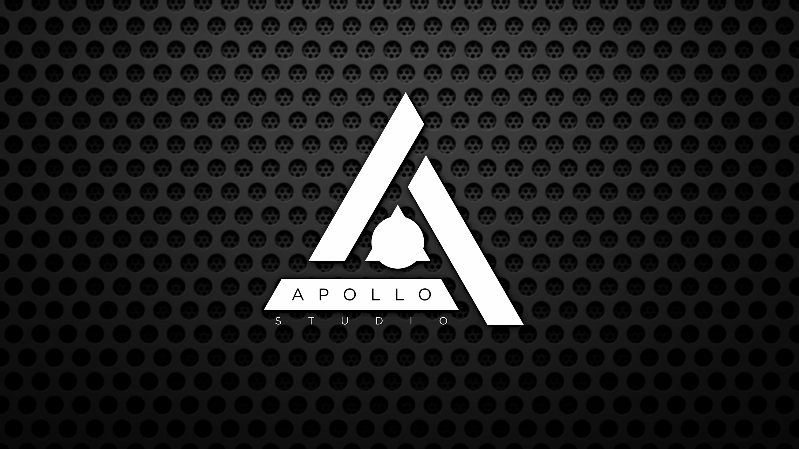

# 介绍

Apollo Studio是一个独立的Launchpad灯光效果引擎和编辑器，灵感来自于Ableton Live的传统工作流程。它的创新之处在于其支持真正的RGB颜色（所有262K的颜色）。也拥有改进过的工作流程和更好的资源管理。

这是Launchpadders希望有更好的方式来创建和演奏Launchpad的结果。为了使Apollo Studio变得有趣和易于使用，同时又能帮助你创建具有无限深度和复杂性的灯光，我们投入了大量的时间与精力。

本指南对Apollo Studio 1.7.0及以上版本有效

希望你喜欢Apollo Studio，并用它提高你的制作流程。

