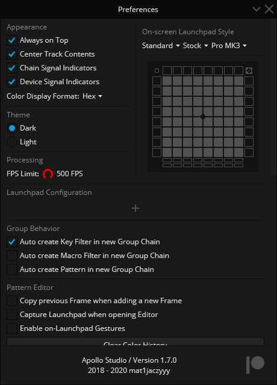

# 初次设定与总概括


我们建议你阅读 项目结构页 ，它概括了Apollo Studio的所有内容和功能。

其余的页面可作为该页介绍的材料的深入参考


为了确保你的灯光尽可能顺利展示，请确保你的Launchpad固件是最新的，当Apollo Sutdio检测到固件版本低于推荐固件时，将会弹出窗口，你可以使用Novation Component或Launchpad Utility来更新

如果你运行的是Windows系统，Apollo Studio需要安装Novation USB Driver 2.17.10或更新的版本才能运行（推荐使用USB Driver 2.22，不会蓝屏）。

驱动是为了使你的Launchpad能够同时与多个进行MIDI交互的应用程序兼容（如Ableton Live），当Apollo检测到未安装驱动时将会弹窗

## 主页

当Apollo启动时，你看到的第一界面便是主页，它由一些标签页组成。在这个页面上，你可以启动你的Apollo工程，与Apollo社区互动或了解开发者的最新更新。

在文件选项卡上，你可以看到“最近打开的项目”列表，以及两个按钮，用于“创建一个新的项目（New Project）”或“从磁盘上打开一个现有的项目（Open Project）”。你可以用CTRL+N（PC）或CMD+N（Mac）和CTRL+O（PC）或CMD+O（Mac）快捷键快速使用这些按钮。

在Windows上，你也可以直接将文件拖到窗口上来打开。

**在 "学习 "标签页上，你会发现有几个按钮可以进行链接的跳转**：

* 说明文档Documentation会跳转至Apollo Studio的Github 英文Wiki
* 视频教程Video Tutorials会跳转至YouTube Apollo视频教学的播放列表
* 报告问题Report a Bug会跳转至GitHub上并开启一个Bug提交的Issue。
* 功能请求Feature Request会跳转至GitHub上并开启一个功能新增请求的Issue。
* 问问题Ask a Question会跳转至GitHub上并开启一个提问的Issue。
* Discord服务器会跳转至Apollo Studio的官方Discord群组。
* 官方网站Official Website会跳转至Apollo Studio的官方网站。
* 成为赞助人Become a Patron会跳转至Apollo Studio的Patreon页面。

在新闻标签页上，你可以找到Apollo Studio官方网站上最新的博客文章的链接，以及新版本更新的修改说明。

如果有新版本的Apollo Studio，你会注意到一个自动更新的标语。请留意新版本！

## 偏好设置

你可以在Apollo Studio的偏好设置中找到所有的设置项，这些设置决定了Apollo Studio外观、行为和与外接设备的设定。这个窗口可以从主页左上角的齿轮进入，也可以通过“CTRL+, \(PC\)“或“CMD+, \(Mac\)”快捷键进入

Apollo偏好设置有几个部分：

* 外观Appearance改变用户界面的布局或风格
* 主题Theme改变Apollo界面的颜色_**（请注意，需要重新启动才能使改变生效）**_
* 处理Processing限制了任何时候在Launchpad上的每秒最大帧数（FPS）。这个参数很重要，因为过高的FPS会使Launchpad的灯光滞后，或者在生成灯光效果时CPU使用率过高
* On-Screen Launchpad风格设置Launchpad在编辑灯光时的显示方式
* Launchpad Configuration~~用来帮助Apollo识别MIDI端口作为启动板。~~可以为每个Launchpad设置旋转，以及按键输入模式。此外，也可以创建虚拟Launchpad
* Group Behavior设置主编辑器在向组添加链时的行为
* Pattern Editor设置Pattern编辑器的默认行为，并允许你清除你生成的颜色的历史几率
* Pattern MIDI Import Palette可以设置Pattern编辑器导入灯光MIDI文件时为MIDI灯光套用的默认Palette（调色板）
* File Management可以调整Apollo Studio在你工作时如何在后台处理你的文件，以及清除主页的“最近打开的项目”列表
* Undo History可以禁用撤回上限**（**_**注意，禁用这一限制将随着时间的推移增加内存占用率）**_
* Discord Rich Presence可以开启在Apollo Studio工作时，在Discord显示“应用程序/游戏”活动状态的接口
* Application Management用于管理自动更新，以及打开存储崩溃日志的文件夹。最好开启自动更新，以免错过重要修复和新功能。在自动更新前，Apollo Studio会在您的同意后才开始下载更新
* Usage Statistics显示当前工程使用情况和在开启Apollo的总时间

